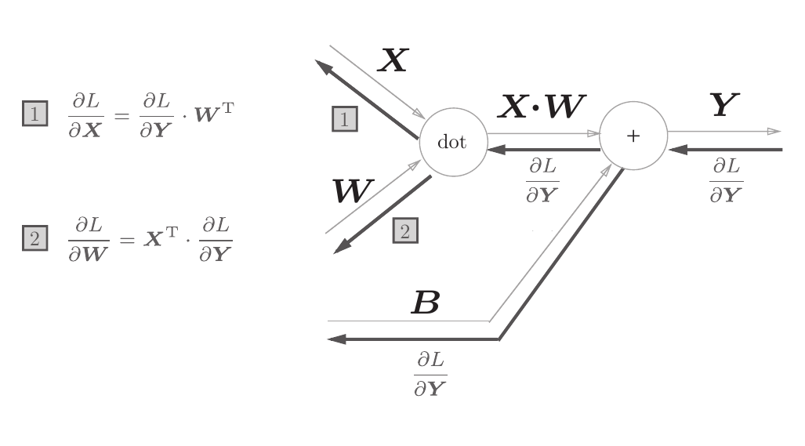

# 仿射变换层（Affine Transformation Layer）

## 1. 计算方法（Computation Method）

图片来自《深度学习入门——基于Python的理论与实现》（作者：斋藤康毅）。

The image is sourced from "Introduction to Deep Learning - Python-based Theory and Implementation" by Yasuti Saito.

### 1.1 正向传播（Forward Propagation）
$$
Y = X \cdot W + B
$$

### 1.2 反向传播（Backward Propagation）
$$
\frac{\partial L}{\partial X} = W^T \cdot \frac{\partial L}{\partial Y}
$$

$$
\frac{\partial L}{\partial W} = X^T \cdot \frac{\partial L}{\partial Y}
$$

$$
\frac{\partial L}{\partial B} = \frac{\partial L}{\partial Y}
$$

