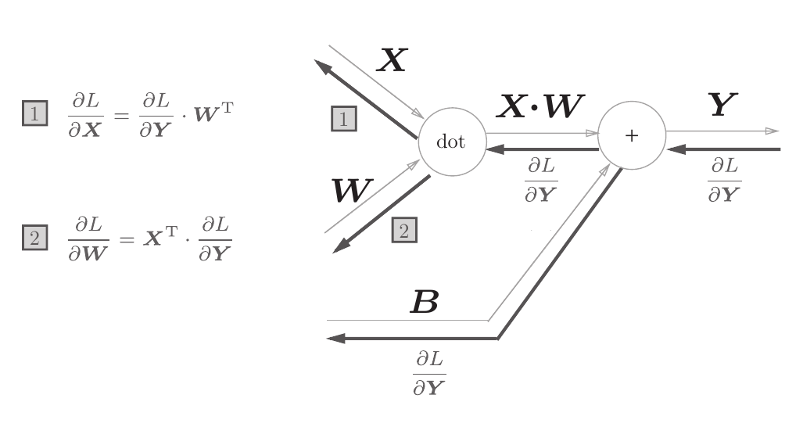

# 仿射变换层（Affine Transformation Layer）

## 1. 什么是仿射变换（What is an Affine Transformation?）
仿射变换是一种特殊类型的变换，它保持点之间的共线性(即直线上的点保持在直线上)，并保持直线上的点之间的距离比。简单地说，虽然形状可以通过仿射变换改变大小、旋转或位置，但它们的基本结构或平行性是保留的。

An affine transformation is a specific type of transformation that maintains the collinearity between points (i.e., points lying on a straight line remain on a straight line) and preserves the ratios of distances between points lying on a straight line. Put simply, while shapes may change in size, rotation, or position through an affine transformation, their basic structure or parallelism is preserved.

在数学上，仿射变换可以表示为：

Mathematically, an affine transformation can be expressed as:
$$
T(v) = Av + b
$$
其中（Where）：
- $T(v)$：变换向量。（Transformed vector.）
- $A$：表示线性变换的矩阵。（Matrix representing the linear transformation.）
- $v$：原始向量。（Original vector.）
- $b$：平衡向量。（Translation vector.）

这个等式表明仿射变换由两部分组成：线性变换（由矩阵$A$表示）和平移（由向量$b$表示）。

This equation shows that an affine transformation consists of two parts: a linear transformation (represented by matrix $A$) and a translation (represented by vector $b$).

## 2. 计算方法（Computation Method）

图片来自《深度学习入门——基于Python的理论与实现》（作者：斋藤康毅）。

The image is sourced from "Introduction to Deep Learning - Python-based Theory and Implementation" by Yasuti Saito.

我们可以从图片中了解到affine层正向与反向传播的计算方法。

We can understand the calculation of forward and backward propagation of affine layer from the picture.

### 2.1 正向传播（Forward Propagation）
$$
Y = X \cdot W + B
$$

### 2.2 反向传播（Backward Propagation）
$$
\frac{\partial L}{\partial X} = W^T \cdot \frac{\partial L}{\partial Y}
$$

$$
\frac{\partial L}{\partial W} = X^T \cdot \frac{\partial L}{\partial Y}
$$

$$
\frac{\partial L}{\partial B} = \frac{\partial L}{\partial Y}
$$

