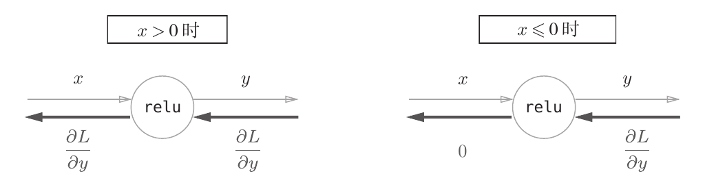

# 线性整流层（ReLU Layer）

## 1. 正向传播计算方法（Forward propagation calculation method）
$$
h(x) = 
\begin{cases}
x & (x > 0) \\
0 & (x \leq 0) \\
\end{cases}
$$

## 2. 反向传播计算方法（Backpropagation calculation method）
正向传播在上面展示的公式中已经表示得很清楚了，这里不再赘述。

The forward propagation is well represented in the formulas shown above and will not be repeated here.

图片来自《深度学习入门——基于Python的理论与实现》（作者：斋藤康毅）。

The image is sourced from "Introduction to Deep Learning - Python-based Theory and Implementation" by Yasuti Saito.