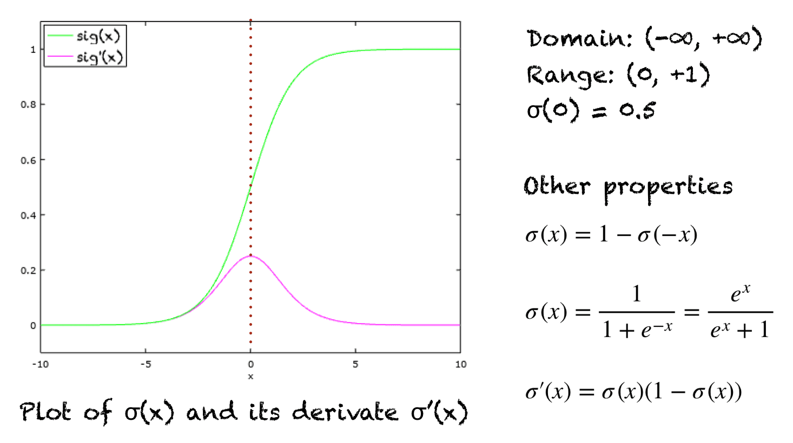
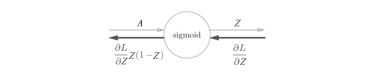

# Sigmoid层（Sigmoid Layer）

内容摘自 machinelearningmastery.com 网站的文章：[A Gentle Introduction To Sigmoid Function](https://machinelearningmastery.com/a-gentle-introduction-to-sigmoid-function/)。

## 1. Sigmoid函数（Sigmoid Function）
sigmoid 函数是对数函数的一种特殊形式，通常用 σ(x) 或 sig(x) 表示。其计算公式为

The sigmoid function is a special form of the logistic function and is usually denoted by σ(x) or sig(x). It is given by:
$$
σ(x) = \frac{1}{1 + e^{-x}}
$$

## 2. Sigmoid函数的性质和特征（Properties and Identities Of Sigmoid Function）
如下图中的绿线所示，S 形函数的图形是一条 S 形曲线。图中还用粉红色显示了导数的图形。导数的表达式以及一些重要性质如右图所示。

The graph of sigmoid function is an S-shaped curve as shown by the green line in the graph below. The figure also shows the graph of the derivative in pink color. The expression for the derivative, along with some important properties are shown on the right.

其他一些属性包括：

A few other properties include:
- 域（Domain）：(-∞, +∞)
- 输出范围（Range）：(0, +1)
- σ(0) = 0.5
- 函数是单调递增的。（The function is monotonically increasing.）
- 函数在任何地方都是连续的。（The function is continuous everywhere.）
- 函数在其域内处处可微。（The function is differentiable everywhere in its domain.）
- 在数值上，只需计算该函数在一个小范围内的值即可，例如 [-10，+10]。对于小于 -10 的数值，函数值几乎为零。对于大于 10 的数值，函数值几乎为 1。（Numerically, it is enough to compute this function’s value over a small range of numbers, e.g., [-10, +10]. For values less than -10, the function’s value is almost zero. For values greater than 10, the function’s values are almost one.）

## 3. 反向传播计算方法（Backpropagation calculation method）
正向传播在前面的介绍中已经说明，所以这里只介绍反向传播的计算方法。

Forward propagation was explained in the previous introduction, so only the calculation of back propagation is presented here.

$$
\frac{\partial L}{\partial A} = \frac{\partial L}{\partial Z} Z (1 - Z)
$$