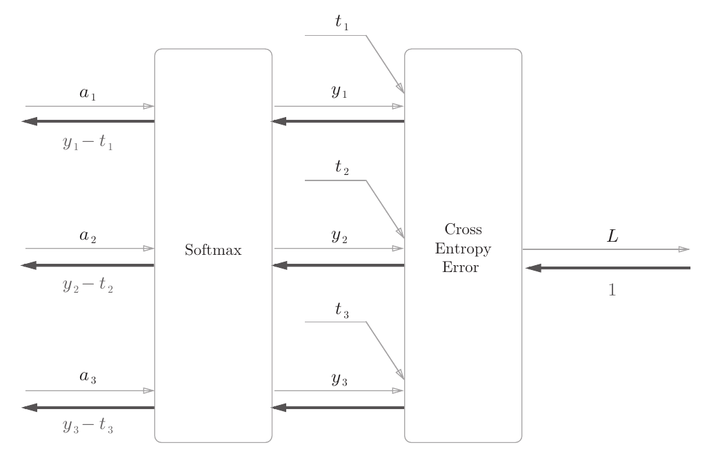

# Softmax与交叉熵误差组合层（Softmax and cross-entropy error combination layer）

## 1. 正向传播计算方法（Forward propagation calculation method）

### 1.1 Softmax函数（Softmax function）
$$
y_k = \frac{e^{a_k}}{\displaystyle\sum_{i=1}^Ne^{a_i}}
$$

### 1.2 交叉熵误差函数（Cross-entropy error function）
$$
L = -\displaystyle\sum_k t_k\log y_k
$$

## 2. 反向传播计算方法（Backward propagation calculation method）

图片来自《深度学习入门——基于Python的理论与实现》（作者：斋藤康毅）。

The image is sourced from "Introduction to Deep Learning - Python-based Theory and Implementation" by Yasuti Saito.